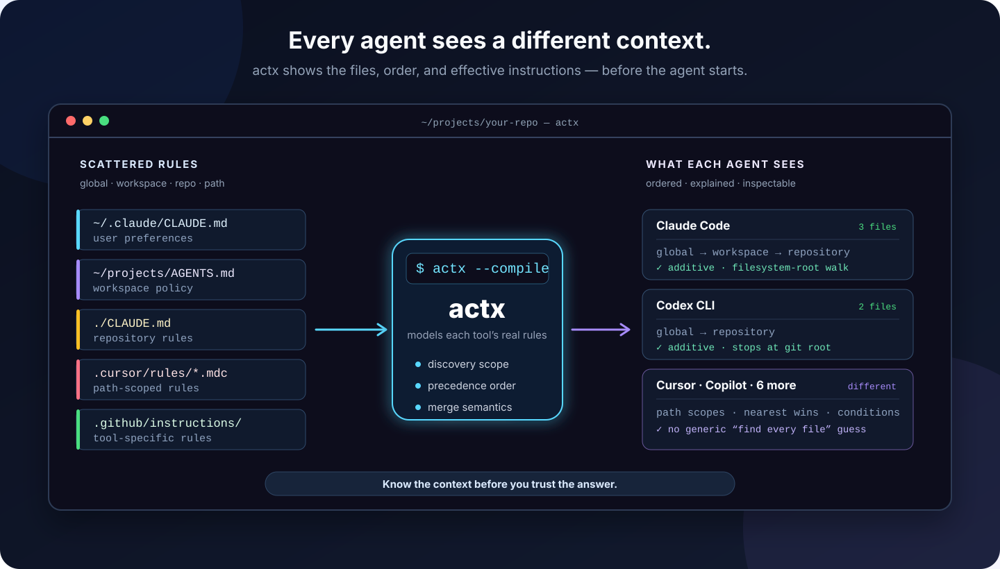

# actx

[](https://github.com/citadelgrad/agent-context-assembled/actions/workflows/ci.yml)
[](LICENSE)

Shows the **full compiled set** of AI coding-agent instruction files that actually apply at a
given directory — across every major AI coding agent (Claude Code, Codex CLI, GitHub Copilot,
OpenCode, Cursor, Windsurf, Cline, Aider, Gemini CLI) — not just one tool.



Every AI coding agent has its own file(s) it reads for persistent instructions (`CLAUDE.md`,
`AGENTS.md`, `.cursor/rules/*.mdc`, `.clinerules/`, ...), its own rule for how far up the
directory tree it walks, its own global/user-level config location, and its own precedence order
when multiple files apply. This tool answers, for a real directory on disk: **"if I ran each of
these agents here, what instructions would actually be loaded, in what order, from where?"**

See [docs/research.md](docs/research.md) for the sourced research behind each tool's behavior,
and [docs/design.md](docs/design.md) for the compiled-view algorithm design (including diagrams).

## What "compiled" means, and why it differs per tool

"Compiled" here means: the full, ordered, real-world result of a tool's own discovery and merge
rules — not a generic "list every file named X up the tree" scan. Each tool gets that treatment
because their actual rules genuinely differ:

- **How far up they walk.** Claude Code and Gemini CLI walk all the way to the filesystem root.
  Codex CLI, OpenCode, and Windsurf stop at the git repository root. Cursor, Cline, and Aider
  (in the sense of an instructions file) are effectively single-directory / config-file tools.
- **Whether they walk down.** Some tools also pick up files in subdirectories below the target
  (e.g. Gemini CLI, Windsurf) — either eagerly (this tool actually scans for them) or lazily
  (loaded on-demand as the agent reads files there; this tool documents that behavior via a note
  rather than pretending it already happened).
- **How multiple files combine.** Most tools concatenate additively, least-specific first (global,
  then each ancestor root-to-target, then the target itself). OpenCode is different: only the
  *nearest* matching ancestor file wins — ancestors are not stacked.
  Copilot layers org -> repo-wide -> path-scoped -> personal.
- **Where the global config lives.** Each tool has its own user-level file/dir
  (`~/.claude/CLAUDE.md`, `~/.codex/AGENTS.md`, `~/.gemini/GEMINI.md`,
  `~/.config/opencode/AGENTS.md`, `~/Documents/Cline/Rules`, `~/.codeium/windsurf/memories/global_rules.md`, ...).

Because of this, the tool does not apply one generic rule to all 9 tools. Each tool is modeled as
its own spec (scope, walk direction, precedence, global path) in
[`internal/tools/tools.go`](internal/tools/tools.go), driven directly by the sourced findings in
`docs/research.md`. The output for each tool lists its contributing files in that tool's own real
application order (earlier = applied first / least specific; later = applied last / wins on
conflict) — not alphabetical order, not discovery order.

Note that the walk itself goes all the way to the **filesystem root**, not just the repo root —
so you can see, e.g., an org-wide `CLAUDE.md` living one or more directories above a repo. Each
tool's own section, though, only shows the files that tool would truly have loaded given its real
scope (a repo-root-limited tool won't show you that org-wide file, even though the walk saw it).

## Usage

```
actx [flags] [path]
```

`path` defaults to the current directory. Flags must come before `path` (Go's flag
parser stops at the first non-flag argument), e.g. `actx --json .`, not `actx . --json`.

Flags:

- `--json` — output structured JSON instead of text (see below for shape).
- `--all` — include every supported tool, even ones with zero contributing files. By default,
  only tools with at least one matching file are shown.
- `--full` — show full file content in text output instead of a size-limited preview (JSON output
  is always full content regardless of this flag).
- `--compile` — instead of just listing matched files, actually assemble them into an "effective
  compiled context" preview per tool, in that tool's own real merge order. See
  [Compiled-context preview](#compiled-context-preview---compile) below.
- `--live` — best-effort runtime introspection: look for real on-disk session artifacts (or name
  a documented interactive mechanism) showing what a tool *actually* loaded in a real session, as
  opposed to what it would predict from files on disk. Every tool is always reported (`--all` has
  no effect, since a "nothing found" result is itself meaningful here); still takes `[path]` to
  scope tools whose artifacts can be matched to a project directory. See
  [Runtime introspection](#runtime-introspection---live) below.
- `--tool` — restrict output to a comma-separated list of tool slugs, e.g.
  `--tool=claude-code,codex-cli`. Pass `--tool=list` to print all valid slugs and exit (one per
  line by default, or a JSON array if combined with `--json`). An unknown slug is a usage error
  (exit 2). Selection happens before discovery: excluded tools' instruction files and session
  artifacts are not read.
- `--version` — print the version and exit.
- `--max-chars` — safety cap on total output size in Unicode code points (default `80000`, ~20,000
  tokens at this tool's character-count/4 estimate). Output over the cap is written to a temp file
  instead of stdout, with a short notice (structured JSON in `--json` mode) printed in its place — so a large
  scan can't silently fill a calling agent's context window. This is an actx-side default, not a
  claim about any tool's own limit (compare the sourced, documented limits under `LimitChecks` in
  `--compile` output). Pass `--max-chars=0` to disable the cap and always print full output.
- `--out` — when output exceeds `--max-chars`, write the full output to this caller-chosen,
  persistent path instead of an OS-managed temp file. Without `--out`, overflow files are
  intentionally left in the OS temp directory for the OS to clean up; actx cannot safely remove
  them because callers may need to read them after the process exits. New `--out` files are created
  with owner-only permissions; existing files retain their current permissions. The complete file
  is published before its path is announced. If the notice itself fails to write, a caller-chosen
  output file remains published and the command reports an error.

### Agent/scripting notes

- **Errors**: on failure, a message goes to stderr and the process exits non-zero. Under `--json`,
  the error is a JSON object (`{"error": "..."}`) instead of plain text, so stderr stays parseable
  in either mode.
- **Output size guard**: any mode/flag combination can trigger the `--max-chars` overflow notice
  above (default 80000 chars) — check for a `truncated: true` field in JSON output, or the text
  "Output too large" in text output, rather than assuming a response always contains real content.
  This caps delivered output, independently of the input and staging budgets below.
- **Resource budgets**: scans fail with an actionable error rather than return partial context.
  Live reports use `incomplete: true` when discovery or reading cannot finish; they omit partial
  content and explain the reason. A live command can exit `0` with incomplete reports, so inspect
  that field rather than treating the exit code as proof of complete discovery.
- **Terminal safety**: text output displays terminal control characters as hexadecimal escapes,
  preserving newlines, tabs, and printable Unicode. JSON retains the original string values;
  callers displaying decoded JSON in a terminal must escape them themselves.
- **Exit codes**: `0` success, `1` runtime error (bad path, scan failure), `2` usage error (bad
  flag, unknown `--tool` slug). `--help`/`-h` prints usage and exits `0` (it's a request, not a
  failure).
- **Stable identifiers**: every tool carries the same `slug` field across all three JSON output
  modes (default, `--compile`, `--live`) — use it for filtering/joining rather than the display
  `tool` name, which is free-form text.
- **Tool-count consistency**: default and `--compile` JSON omit tools with no contributing files
  unless `--all` is passed; `--live` JSON always includes every tool regardless of `--all` (see
  above). Pass `--all` explicitly if your caller assumes a fixed-length array.

### Resource and filesystem safety

These are actx safety policies, not limits imposed by the inspected tools. Each scan or live
inspection shares one input budget across its selected tools:

- 16 MiB per content read and 64 MiB aggregate input bytes;
- 1,024 content reads, 2,048 directory-listing attempts, 32,768 directory entries, and 4,096
  candidate matches. Repeated work counts again; irrelevant directory entries also count.

Directory entries are acquired in bounded batches, not loaded in full before checking the cap.
An extra byte or entry distinguishes an exact-limit input from an oversized one. Existing
downward-walk depth/visit limits and recursive-glob depth limits now produce explicit errors if
they would omit eligible input. Narrow the target or use `--tool` to reduce work. These defaults
are fixed policies, not additional CLI flags; `--max-chars=0` does not disable input budgets.

Capped rendering retains at most 256 KiB of rendered bytes in its staging buffer, then spills to
a private temporary file. Staged output is limited to 64 MiB; atomic output publication can
temporarily need a second copy, for up to 128 MiB of temporary disk space. `--max-chars=0` streams
directly without staging, so a later rendering or sink error can leave partial stdout. Compiling,
JSON encoding, and formatting still allocate input-derived objects; this is not a process-wide
memory ceiling. `--out` is untouched when the delivered-output cap is not exceeded.

On Unix, instruction/session content opens use nonblocking acquisition followed by regular-file
descriptor validation. A regular file replaced by a writerless FIFO cannot stall that open.
Ordinary instruction symlinks remain supported; Aider history links stay confined to the target
project. Windows validates the opened descriptor but does not have this Unix nonblocking-open
guarantee. Other unsupported platforms fail closed for content opens. None of these policies is
a hard deadline for kernel calls, network filesystems, or arbitrary device drivers, nor an atomic
snapshot of a changing filesystem.

### Examples

Show the compiled view for the current directory:

```
actx
```

Show it for another path, listing every supported tool (including ones with nothing found):

```
actx --all /path/to/some/repo/subdir
```

Get machine-readable output, e.g. to pipe into `jq`:

```
actx --json . | jq '.[].tool'
```

Show the assembled effective context per tool, with token estimates:

```
actx --compile
```

Same, as JSON:

```
actx --compile --json . | jq '.[] | {tool, tokenEstimate}'
```

Check what a tool actually loaded in a real session (best-effort):

```
actx --live
```

### JSON shape

`--json` prints an array with one object per tool (only tools with matches, unless `--all`):

```json
[
  {
    "tool": "Claude Code",
    "slug": "claude-code",
    "precedenceNote": "Additive concatenation: managed -> user (~/.claude/CLAUDE.md) -> ...",
    "files": [
      { "path": "/Users/you/.claude/CLAUDE.md", "content": "...", "note": "global: user-level" },
      { "path": "/path/to/repo/CLAUDE.md", "content": "...", "note": "target dir: project instructions" }
    ]
  }
]
```

`files` is always in the tool's real application order. `content` is always the complete file —
JSON output is never truncated, even when the text renderer would preview-truncate the same file.

## Compiled-context preview (`--compile`)

`--compile` goes one step further than the default mode: instead of just listing which files
contribute, it actually assembles them into the "effective compiled context" a tool would see —
in that tool's own real merge order — with clear separators showing which file each chunk came
from and why it's included. It also reports a rough token-count estimate and, for the two tools
with a sourced documented limit, whether the assembled content would exceed it.

Merge semantics differ per tool and are applied accordingly (see
[docs/design.md](docs/design.md#step-6----compile-assemble-the-effective-compiled-context) for
the full breakdown):

- **Additive concatenation** (Claude Code, Codex CLI, Cline, Gemini CLI) — every matched file is
  appended in precedence order, after resolving overrides. For Codex, `AGENTS.override.md`
  replaces `AGENTS.md` in the same project directory before assembly and byte-limit checks.
  The default raw file inventory still shows both files when present.
- **Conditional / path-scoped** (GitHub Copilot's `applyTo`-scoped `.instructions.md`, Cursor's
  rule-type frontmatter, Windsurf's `trigger`/`globs` frontmatter) — chunks are included with an
  explicit `condition` (e.g. `applyTo: **/*.go`) rather than assumed to always apply.
- **First-match-wins** (OpenCode) — only the nearest matching file is assembled; skipped
  ancestors are noted, not silently dropped.
- **N/A** (Aider) — nothing is auto-loaded, so `--compile` reports the tool as empty with an
  explanation rather than fabricating content.

Token counts are a simple Unicode-character-count/4 heuristic, always labeled as an **estimate**,
never presented as an exact tokenizer count. Documented-size-limit checks are only run for tools where
`docs/research.md` cites a sourced numeric limit: Codex CLI's `project_doc_max_bytes` (32 KiB
default) and Windsurf's `global_rules.md` (6,000 chars) / per-file rules (12,000 chars) caps.
Every other tool skips this check rather than inventing a number.

`--compile --json` emits one object per tool with `mergeModel`, `chunks` (each with `path`,
`reason`, optional `condition`, `content`, and per-chunk char/token counts), the full `assembled`
string, `charCount`/`tokenEstimate`, and `limitChecks` where applicable.

## Runtime introspection (`--live`)

Both modes above *predict* what a tool would load, from files on disk. `--live` asks a different
question: can we see what a tool **actually** loaded, in a real past or current session — the
ground truth, not a prediction? This is inherently best-effort and varies wildly by tool, since
it depends on undocumented or semi-documented internals that can change across tool versions.

Every selected tool gets a report — the CLI never silently omits a selected tool, even when
nothing is discoverable. Without `--tool`, all supported tools are selected. Each report is
classified into one of four mechanisms:

| Mechanism | Meaning |
|---|---|
| `content-confirmed` | Real extracted content — a genuine artifact was found and parsed |
| `metadata-only` | An artifact exists, but content is unavailable, empty, over the input budget, or too fragile to parse reliably; only metadata is reported |
| `documented-flag-not-run` | A real, docs-confirmed mechanism exists but is interactive or must be enabled before a session runs — nothing to retroactively read |
| `none` | Nothing discoverable at all |

Highlights (full sourced detail in
[docs/research.md](docs/research.md#runtime-introspection)):

- **Codex CLI** — strongest result: session rollout JSONL files under `~/.codex/sessions/` contain
  `base_instructions` (fixed system prompt) and `user_instructions` (compiled AGENTS.md payload)
  verbatim. `--live` scopes this to the target directory via each rollout's embedded `cwd`.
  Project instructions come from the latest decoded turn, not the last nonempty earlier turn.
  A matching `cwd` without recovered instructions is reported as metadata only.
- **Aider** — if `--llm-history-file` was used, `.aider.llm.history` contains the real system
  prompt verbatim (confirmed in source); the default `.aider.chat.history.md` does not.
  Reads are confined to the target project: relative in-project symlinks are supported, but
  escaping and absolute symlinks are refused. Empty histories and histories exceeding actx's
  16 MiB input budget are reported as metadata only, without partial content. This budget is
  an actx safety policy, not an Aider limit.
- **Claude Code** — session transcripts exist and are located, but do not contain the verbatim
  compiled system prompt; the real mechanism (`OTEL_LOG_RAW_API_BODIES`) requires OpenTelemetry
  logging configured ahead of time, not a retroactive read.
  Encoded project-directory names can collide; transcript paths/counts are candidates with
  unverified project scope, not proof that those sessions belong to the requested directory.
- **OpenCode** — `opencode export <sessionID>` is a real, confirmed way to dump the actual system
  prompt, but it's a command you run, not a file this CLI can read on its own.
- **GitHub Copilot / Windsurf / Cline** — each has a real, docs-confirmed mechanism (VS Code's
  Chat Debug View; an opt-in Cascade transcript hook; Cline's task history, respectively), but
  either requires manual/interactive use, must be enabled beforehand, or (Cline, per official
  docs) explicitly excludes the system prompt from what's persisted.
- **Cursor** — no officially documented mechanism. A `state.vscdb` SQLite file is known to exist
  and hold chat data, but its schema is explicitly undocumented by Cursor; `--live` reports its
  presence only and does not attempt to parse it.

`--live --json` emits one object per tool with `mechanism`, `summary`, `detail`, `confidence`, and
(where applicable) `artifactPath`, `artifactCount`, `lastModified`, `extractedContent`.
An interrupted discovery/read adds `incomplete: true`; a healthy report omits that field. An
incomplete Codex search never promotes an older readable rollout to confirmed latest content.

## What it checks

For each of the 9 tools, per its own documented real-world rules:

1. The tool's global/user-level config file or directory (checked once, independent of target).
2. The tool's local instruction file pattern(s), checked across every ancestor directory that
   tool's own scope rule says it would actually consult — filesystem-root-to-target for some
   tools, git-root-to-target for others, target-only for others.
3. For tools documented to eagerly scan subdirectories below the target, a bounded recursive scan
   downward (capped depth/directory count; skips `.git`, `node_modules`, `vendor`, `.venv`,
   `dist`, `build`, `.cache`, and dotdirs).

Known gaps (see `docs/research.md` for the full list of UNCONFIRMED items and out-of-scope
behaviors): managed/enterprise-pushed config (e.g. MDM `managed-settings.json`) is not scanned;
`@import`/include syntax inside instruction files is not expanded, content is shown as-is; lazy
subdirectory loading is noted, not simulated.

## Why Go, and why no dependencies

Go was chosen for a single static, portable, cross-compilable binary with no runtime dependency
(no interpreter/VM to install, no `node_modules`, no venv) — a good fit for a CLI meant to be run
ad hoc in arbitrary directories on arbitrary machines. The implementation uses only the Go
standard library (`flag`, `os`, `path/filepath`, `encoding/json`, `sort`, `strings`, `fmt`, `io`,
`bufio`, `time`) — the problem (walk directories, match glob patterns, read files, parse JSONL,
print/encode) doesn't need anything beyond what the stdlib already provides well, including a
hand-rolled recursive-glob (`**`) matcher (`filepath.Glob` doesn't support it), a hand-rolled
minimal frontmatter reader (`internal/compile`, for the handful of `key: value` fields the
conditional-merge tools need — deliberately not a general YAML parser), and line-by-line
`encoding/json` parsing of JSONL transcripts/rollouts (`internal/inspect`). None of this needed an
external glob, YAML, or JSONL library — **`--compile` and `--live` added zero new dependencies.**

## Testing

```
go test ./...
```

Tests are hermetic (`$HOME` is redirected to a temp dir, so nothing reads this machine's real
`~/.claude`, `~/.codex`, etc.) and use only the standard `testing` package — no test-framework
dependency.

### Property tests and fuzzing

Example tests prove that known inputs produce known outputs. That is necessary, but it is weak
coverage for `actx`: its behavior depends on arbitrary Unicode, malformed frontmatter and JSONL,
filesystem layouts, glob patterns, precedence rules, and long sequences of records. The interesting
failures live in combinations nobody would think to write as individual fixtures.

The test suite therefore also describes properties that must hold for whole classes of input, using
Go's native fuzzing support and deterministic generated cases. These tests check invariants such as:

- compiling instruction files is a lossless, ordered transformation;
- filtering is stable, order-preserving, and idempotent;
- text truncation preserves valid UTF-8 and counts Unicode code points rather than bytes;
- JSON rendering preserves content and order, respects filtering, and has stable empty-output shapes;
- Codex rollout parsing behaves like a state machine: irrelevant records do not matter, later
  relevant records win, and malformed or partial input cannot silently produce confirmed state;
- glob expansion and downward scans stay inside their root, return sorted unique regular files,
  honor depth/visit limits, and behave deterministically; and
- artifact counts and newest timestamps ignore directories, symlinks, and unrelated filesystem
  entries where those node types are not valid artifacts.

This work found real bugs rather than merely increasing a coverage number. It fixed UTF-8 previews
that could split characters, byte-based "character" limits, partial Codex state accepted after a
scanner error, empty records erasing prior instructions, incorrect global fallback precedence,
duplicate downward matches, traversal-limit boundary errors, and artifact counts that disagreed
with the accepted file types. The minimized cases remain as regression tests.

Ordinary `go test ./...` runs every committed fuzz seed deterministically. CI also mutates all
registered fuzz targets for a bounded time on every push and pull request, with longer scheduled
runs. A matrix-coverage check fails CI if a `Fuzz*` target is added, removed, or renamed without
updating the workflow. To fuzz one target locally:

```bash
go test ./internal/inspect -run '^$' -fuzz '^FuzzReadCodexRolloutStateMachine$' -fuzztime 30s
```

See [CONTRIBUTING.md](CONTRIBUTING.md#fuzz-testing) for corpus policy and filesystem-fuzzing safety
rules.

## Build

```
go build -o actx ./cmd/actx
```

## Project layout

- `cmd/actx/` — CLI entry point (flag parsing, dispatch to scan/compile/inspect+render).
- `internal/tools/` — static per-tool specs (filenames, scope, precedence, global config paths).
- `internal/budget/` — shared finite input-byte, content-read, directory-entry and candidate budgets.
- `internal/fileio/` — regular-file descriptor validation and Unix nonblocking content opens.
- `internal/scan/` — directory-walk + file-matching engine; always returns full file content.
- `internal/compile/` — `--compile`: assembles matched files per tool's real merge model, with
  chunk separators, token estimates, and documented-limit checks.
- `internal/inspect/` — `--live`: best-effort runtime introspection per tool (session/log/debug
  artifact discovery, classified by mechanism confidence).
- `internal/render/` — text and JSON renderers for all three modes; preview truncation (text-only)
  lives here.
- `docs/research.md` — Phase 1 sourced research per tool, plus a runtime-introspection section.
- `docs/design.md` — Phase 2 algorithm design, including Mermaid diagrams.

## Contributing

See [CONTRIBUTING.md](CONTRIBUTING.md).

## License

[MIT](LICENSE)
