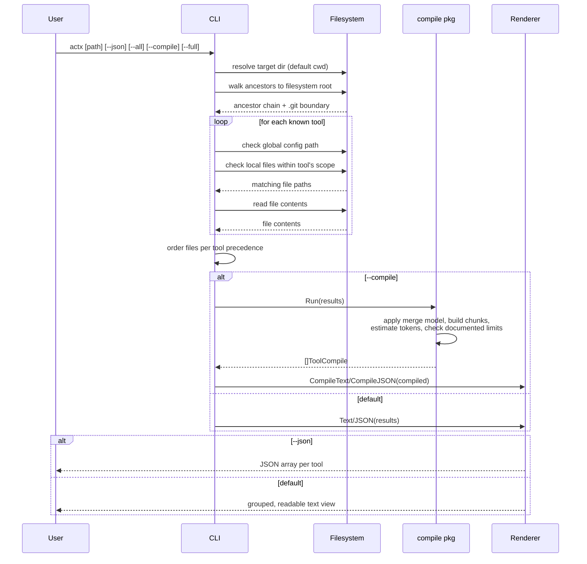
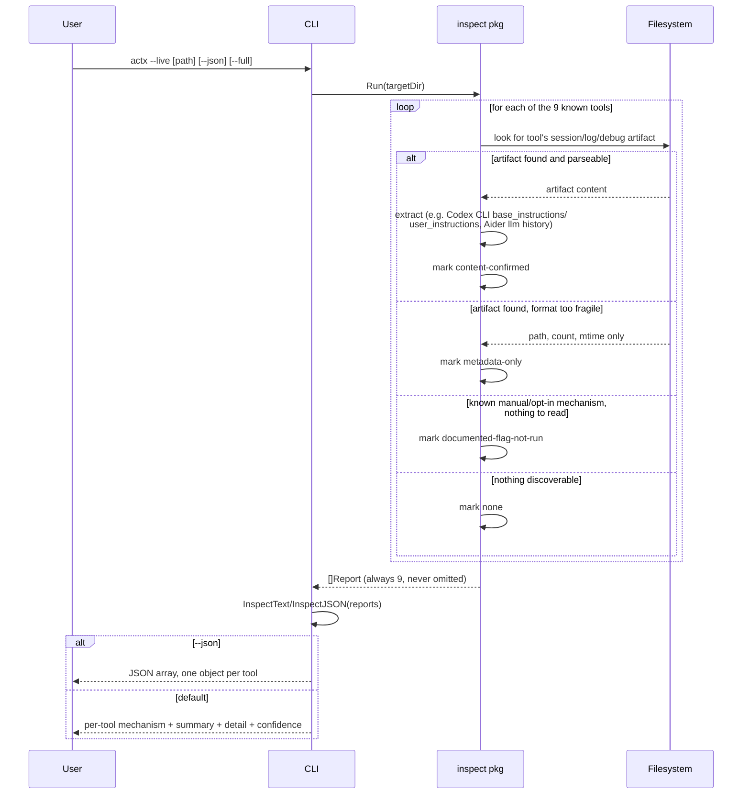

# Design: compiled-view algorithm

## Goal

Given a target directory (default: cwd), produce a "compiled view" of every AI coding-agent
instruction file that would actually be in effect there, for every tool surveyed in
[research.md](./research.md) — grouped by tool, in that tool's own real application order.

## Inputs

- `target` — directory to evaluate. Defaults to cwd.
- `home` — the user's home directory (`os.UserHomeDir()`), used for global config lookups and as
  one possible upward-walk boundary.
- Filesystem root — the walk's hard stop. We do **not** stop at the repo root (a `.git` directory)
  because the user explicitly wants to see the repo-level file *and* whatever is one or more levels
  above the repo (e.g. an org-wide monorepo-of-repos convention, or a personal
  `~/code/CLAUDE.md`). We still *detect* and record where `.git` is, because several tools
  (Codex CLI, OpenCode) genuinely stop their own walk there — the compiled view should show that
  boundary rather than silently pretending those tools see further than they do.

## Step 1 — build the ancestor chain

Starting at `target`, repeatedly take `filepath.Dir(path)` until the result stops changing
(`Dir(path) == path`, which happens at `/` on Unix or `C:\` on Windows). This produces the full
chain from filesystem root down to `target`, e.g.:

```
/
/Volumes
/Volumes/qwiizlab
/Volumes/qwiizlab/projects
/Volumes/qwiizlab/projects/actx
```

Along the way, note which directory (if any) contains a `.git` entry — that's the "repo root"
marker used by tools whose real behavior stops there (Codex CLI, OpenCode).

## Step 2 — per tool, per directory, check for matches

Each tool is modeled as a small spec: canonical filename(s)/glob(s), a scope rule (how far up/down
it actually walks in real life), and a global-config path. For every directory in the ancestor
chain (root -> target), check whether that tool's file(s) exist there, **but only within the
range that tool's own scope rule says it would actually look** — e.g. Codex CLI's model only
considers directories from the detected git root down to `target`; Claude Code's model considers
every directory from filesystem root down to `target` (plus, notionally, any subdirectories below
target the user might later touch — the CLI surfaces those as a separate "reachable below target"
note rather than pretending they're "loaded", since real Claude Code loads them lazily on read).

This is the key design decision: **the tool does not apply one generic rule to all tools.** It
encodes each tool's actual precedence semantics from research.md and only presents what that tool
would truly have loaded.

`--tool` selection is applied before per-tool discovery. Target, home, and discovered directory
names are literal paths; only registry pattern components are interpreted as globs. Reads reject
known non-regular files, while retaining symlinks to regular instruction files. These checks do
not prevent a concurrently replaced file from changing type between stat and open.

## Step 3 — check each tool's global config location once

Independent of `target`, check the tool's documented global/user config path(s) (e.g.
`~/.claude/CLAUDE.md`, `~/.codex/AGENTS.md`, `~/.gemini/GEMINI.md`, `~/.config/opencode/AGENTS.md`,
`~/Documents/Cline/Rules`, `~/.codeium/windsurf/memories/global_rules.md`). Managed/enterprise
paths that aren't practical to detect portably (e.g. MDM-pushed settings) are out of scope for the
prototype and noted as such in the README.

## Step 4 — order each tool's contributing files per its real precedence

Per research.md, the order files are listed for a given tool reflects how that tool actually
applies them (earlier in the list = applied first / less specific; later = applied last / more
specific / wins on conflict), not just alphabetical or discovery order:

Eager descendant discovery preserves deterministic parent-before-child traversal rather than
sorting full file paths, which can place a child rule before its parent.

| Tool | Applied order |
|---|---|
| Claude Code | Managed -> User (`~/.claude/CLAUDE.md`) -> ancestors root-to-target (`CLAUDE.md` then `CLAUDE.local.md` per dir) |
| Codex CLI | Global (`~/.codex/AGENTS.override.md` or `AGENTS.md`) -> project docs git-root-to-target (`AGENTS.md`, overridden per-dir by `AGENTS.override.md`) |
| GitHub Copilot | Org -> Repo-wide (`.github/copilot-instructions.md`) -> path-scoped (`.github/instructions/*.instructions.md`) -> Personal (not file-based; noted only) |
| OpenCode | Global (`~/.config/opencode/AGENTS.md`) -> nearest project file only (git-root-to-target, first match wins so only one entry shown) |
| Cursor | User Rules (not file-based; noted only) -> Project (`.cursor/rules/*.mdc`, `AGENTS.md`) |
| Windsurf | Global (`global_rules.md`) -> workspace rules found git-root-to-target and below target (deduped) |
| Cline | Global (`~/Documents/Cline/Rules`) -> project (`.clinerules/` dir contents, or legacy `.clinerules` file) |
| Aider | Home `.aider.conf.yml` -> git-root `.aider.conf.yml` -> cwd `.aider.conf.yml` (config file, not instructions — noted distinctly since Aider has no auto-loaded instruction file) |
| Gemini CLI | Global (`~/.gemini/GEMINI.md`) -> ancestors git-root-to-target -> subdirectories below target |

## Step 5 — render

Group output by tool. Within a tool, list each contributing file in the order above, showing full
path and content (or a preview, truncated with a note, unless `--full` — see README). Tools with
zero contributing files are omitted unless `--all` is passed.

## Step 6 — `--compile`: assemble the effective compiled context

`--compile` takes the same Step 1-4 output (`scan.ToolResult`) and, per tool, actually concatenates
the matched files into one assembled string — the "effective compiled context" — instead of just
listing them. This lives in `internal/compile`. Per tool:

- **Merge model.** Each tool gets a short label describing how it really merges multiple matched
  files, not a generic assumption:
  - *Additive concatenation* (Claude Code, Codex CLI, Cline, Gemini CLI): every matched file's
    content is appended in precedence order after overrides are resolved. Codex compilation
    removes a local `AGENTS.md` when a same-directory `AGENTS.override.md` is present; this
    effective file list also drives byte-limit checks. The raw scan inventory retains both.
  - *Conditional / path-scoped*: GitHub Copilot (`.github/instructions/*.instructions.md` carries
    an `applyTo` frontmatter glob — only applies to matching files, noted as a condition, not
    unconditionally concatenated), Cursor (`.cursor/rules/*.mdc` frontmatter rule-type field
    controls whether a rule is `always`, `auto-attached`, or `agent-requested`), Windsurf
    (`trigger`/`globs` frontmatter on `.windsurf/rules/*.md` gates inclusion).
  - *First-match-wins*: OpenCode — only the nearest matching project file is included; ancestors
    that would otherwise match are explicitly marked skipped, not silently dropped.
  - *N/A, no auto-load*: Aider — nothing is assembled since Aider doesn't auto-load an instruction
    file; `--compile` reports this tool as empty with an explanatory note rather than fabricating
    a chunk.
- **Chunk separators.** Every contributing file becomes a `Chunk` with `Path`, `Reason` (why it's
  included, e.g. "ancestor directory, root-to-target order"), and `Condition` (for conditional
  tools, the actual frontmatter-derived gate, e.g. `applyTo: **/*.go`) — rendered as a banner
  (`[i/n] SOURCE: ... WHY: ...`) immediately before that chunk's content in the assembled text, so
  it's traceable which file produced which part of the output.
- **Frontmatter extraction.** Because only Copilot/Cursor/Windsurf need a specific frontmatter
  field (`applyTo`, rule-type, `trigger`/`globs`), `internal/compile` hand-rolls a minimal
  line-scanning `key: value` reader over a leading `---`-delimited block — deliberately **not** a
  general YAML parser (no multi-line values, no nested structures), to avoid adding a YAML
  dependency for a need this narrow.
- **Token estimate.** `len(content)/4` per chunk and per tool total, always labeled "estimate" in
  output — never presented as an exact count, since no tool's real tokenizer is used.
- **Documented size-limit checks.** Only checked where research.md cites a sourced numeric limit:
  Codex CLI's `project_doc_max_bytes` (default 32 KiB, source-code-documented, scoped to the
  AGENTS.md project-doc chain only) and Windsurf's `global_rules.md` 6,000-char cap plus per-file
  `.windsurf/rules/*.md` / `.devin/rules/*.md` 12,000-char cap (3-of-4-source agreement). Every
  other tool skips this check entirely rather than inventing a number.

## Step 7 — `--live`: runtime introspection

`--live` is fundamentally different from the default and `--compile` modes: instead of predicting
what a tool would load from on-disk instruction files, it looks for artifacts proving what a tool
actually loaded in a real session. This lives in `internal/inspect`, documented per-tool with
sources in [research.md](./research.md#runtime-introspection). It does not call `scan.Run` at all
(no ancestor-chain walk, no tool-file matching) — it goes straight to each tool's own
session/log/debug artifact location, scoping to the target directory only where that tool's
artifact format makes scoping possible (Claude Code's encoded-cwd project directory, Codex CLI's
embedded `cwd` field per rollout, Aider's per-directory history file, Gemini CLI's project-hash
log directory).

Every selected tool produces a `Report`, classified into exactly one of four mechanisms —
**no selected tool is silently omitted**, even when nothing was found. Selection occurs before
artifact access; without `--tool`, every supported tool is selected:

| Mechanism | Meaning |
|---|---|
| `content-confirmed` | A real on-disk artifact was found and actually parsed/extracted (e.g. Codex CLI rollout `base_instructions`/`user_instructions`, Aider's opt-in `.aider.llm.history`) |
| `metadata-only` | An artifact exists but its format is undocumented or too fragile to parse reliably — report path/count/last-modified only, no content guessing (e.g. Claude Code transcripts, Cursor's `state.vscdb`) |
| `documented-flag-not-run` | A real, docs-confirmed mechanism exists but is interactive or must be enabled before the session runs (Claude Code's `/context` and `OTEL_LOG_RAW_API_BODIES`, OpenCode's `export` subcommand, GitHub Copilot's Chat Debug View, Windsurf's opt-in transcript hook) |
| `none` | Nothing discoverable at all |

Each `Report` carries a `Summary`, `Detail`, `Confidence`, and optionally `ArtifactPath` /
`ArtifactCount` / `LastModified` / `ExtractedContent`, plus `Incomplete` when work cannot finish.
This mirrors the compile-mode principle of
never inventing facts: where content can be honestly extracted, it is; where it can't, the CLI
says so explicitly instead of guessing at a schema.

Codex reports retain the current decoded turn's project instructions, including an empty value,
rather than combining the newest cwd with an older nonempty payload. A cwd match without content
is metadata-only. Claude's encoded directory is only a candidate location because different paths
can encode identically. Aider history reads use a project-confined `os.Root` and a 16 MiB input
budget; oversized and empty histories produce metadata-only reports. This does not establish
artifact authenticity or provide an atomic filesystem snapshot.

## Resource boundaries and file opening

`internal/budget` owns one shared policy per scan or live-inspection invocation: 16 MiB per
content read, 64 MiB aggregate bytes, 1,024 content reads, 2,048 directory-listing attempts,
32,768 acquired entries and 4,096 candidate matches. These are actx policies, not upstream limits.
Repeated operations consume budget again. Directory reads acquire batches of at most 128 entries
and sort only a complete directory; exhaustion does not expose an arbitrary filesystem-order
prefix. Byte and entry limits permit one detection sentinel, then stop further acquisition.

Scanning fails closed with no partial results on budget or existing traversal-depth/visit
exhaustion. Live inspection instead emits a metadata-only report with `incomplete: true`, an
explanation, and no extracted content or misleading partial count/latest timestamp. Completed
earlier reports remain usable; subsequent filesystem probes stop after shared budget exhaustion.
Codex discovery/read failures never silently fall back to an older rollout. The fixed-path Aider
report can retain its known descriptor timestamp without claiming complete content. Intentional
noise-directory exclusions remain exclusions, not budget failures.

`internal/fileio` acquires content descriptors with `O_NONBLOCK` on Unix, then validates the
opened descriptor as regular before any read. This closes the preflight-stat/FIFO-open waiting
window. Ordinary symlinks still resolve; `OpenRegularAt` preserves `os.Root` confinement for Aider
history. Windows provides post-open validation only, without the Unix nonblocking guarantee;
other unsupported platforms fail closed. Directory acquisition uses `os.Root`. None of these
operations provides a hard filesystem-call deadline, a device sandbox, or a content snapshot.

`cmd/actx/output.go` separates delivered character limits from output staging. Capped output uses
a 256 KiB buffer, lazy private-file spill, and a 64 MiB staging limit. Unicode code points are
counted across write boundaries; `--max-chars` does not set either staging budget. Overflow output
is fully prepared and closed before publication. Caller-chosen destinations are replaced before
the success notice is emitted, so a pipe consumer can immediately read the advertised file. A
notice-write failure after publication returns an error but leaves the complete configured file.
Rendering/staging/copy/rename failures preserve the previous destination. Anonymous overflow
files are removed on failed notice delivery; successfully announced files remain for callers.
Atomic publication can transiently use two disk copies, up to 128 MiB. Unlimited mode streams
directly and can leave partial stdout on a later failure. Compilation, encoding and formatting
can still allocate input-derived objects; bounded staging is not a process-wide memory ceiling.

## Flow diagram

```mermaid
flowchart TB
    subgraph INPUT["Input"]
        TARGET["Target dir"]
        HOME["Home dir"]
        MODE["Mode flag"]
    end

    subgraph WALK["Directory walk"]
        CHAIN["Build ancestor chain<br/>root to target"]
        GITDET["Detect .git boundary"]
    end

    subgraph PERTOOL["Per-tool evaluation"]
        SPEC["Tool spec:<br/>filenames + scope + precedence"]
        LOCAL["Match files within<br/>tool's real scope"]
        GLOBAL["Check tool's global<br/>config path"]
    end

    subgraph ORDER["Compile"]
        SORT["Order files by<br/>tool's precedence rule"]
        GROUP["Group by tool"]
    end

    subgraph ASSEMBLE["--compile only"]
        MERGE["Apply merge model<br/>per tool"]
        CHUNKS["Build chunks +<br/>separators"]
        TOKENS["Estimate tokens,<br/>check limits"]
    end

    subgraph LIVE["--live only (bypasses walk)"]
        ARTIFACT["Locate session<br/>artifact per tool"]
        CLASSIFY["Classify mechanism:<br/>confirmed/metadata/none"]
    end

    subgraph OUTPUT["Output"]
        TEXT["Terminal view"]
        JSON["--json"]
    end

    MODE -.default/--compile.-> TARGET
    MODE -.--live.-> ARTIFACT
    TARGET --> CHAIN
    CHAIN --> GITDET
    GITDET --> LOCAL
    SPEC --> LOCAL
    HOME --> GLOBAL
    SPEC --> GLOBAL
    LOCAL --> SORT
    GLOBAL --> SORT
    SORT --> GROUP
    GROUP -->|default| TEXT
    GROUP -->|default| JSON
    GROUP -->|--compile| MERGE
    MERGE --> CHUNKS
    CHUNKS --> TOKENS
    TOKENS --> TEXT
    TOKENS --> JSON
    HOME --> ARTIFACT
    TARGET --> ARTIFACT
    ARTIFACT --> CLASSIFY
    CLASSIFY --> TEXT
    CLASSIFY --> JSON

    classDef input fill:#e1f5ff,stroke:#0288d1,color:#000
    classDef process fill:#fff3e0,stroke:#f57c00,color:#000
    classDef output fill:#e8f5e9,stroke:#388e3c,color:#000
    classDef spec fill:#f3e5f5,stroke:#8e24aa,color:#000
    classDef live fill:#fce4ec,stroke:#c2185b,color:#000

    class TARGET,HOME,MODE input
    class CHAIN,GITDET,LOCAL,GLOBAL,SORT,GROUP,MERGE,CHUNKS,TOKENS process
    class SPEC spec
    class TEXT,JSON output
    class ARTIFACT,CLASSIFY live
```

### Legend

| Node | Meaning |
|---|---|
| Target dir | The directory passed on the CLI, or cwd by default |
| Home dir | `os.UserHomeDir()`, used for global config paths and as a reference point (not a hard boundary) |
| Mode flag | Which of default / `--compile` / `--live` was passed; picks the branch below |
| Build ancestor chain | `filepath.Dir()` repeated from target to filesystem root |
| Detect `.git` boundary | Records which ancestor (if any) contains `.git`, since some tools stop their real walk there |
| Tool spec | Static per-tool table encoding filenames, scope rule, and precedence order (from research.md) |
| Match files within tool's real scope | For each tool, only directories that tool would actually read are checked (e.g. Codex CLI stops at `.git`; Claude Code does not) |
| Check tool's global config path | One-time lookup per tool, independent of target directory |
| Order files by tool's precedence rule | Encodes least-specific-first ordering so later entries are understood to win/apply last |
| Group by tool | Final grouping for both text and JSON renderers |
| Apply merge model per tool | `--compile` only: additive / conditional / first-match-wins per research.md |
| Build chunks + separators | `--compile` only: per-file `Chunk` with path/reason/condition banner |
| Estimate tokens, check limits | `--compile` only: `len/4` estimate; documented-limit check only for Codex CLI / Windsurf |
| Locate session artifact per tool | `--live` only: goes straight to each tool's session/log/debug location, skips the ancestor walk entirely |
| Classify mechanism | `--live` only: content-confirmed / metadata-only / documented-flag-not-run / none, per tool, always emitted |

## Sequence diagram (default and `--compile`)



## Sequence diagram (`--live`)

`--live` bypasses the ancestor walk entirely — it never calls `scan.Run`. Each tool's report is
independent and always emitted, even when nothing is found.


