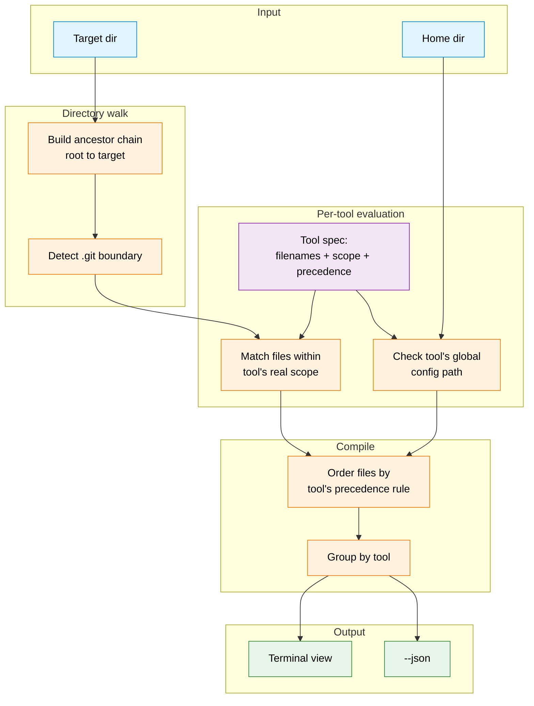

# Design: compiled-view algorithm

## Goal

Given a target directory (default: cwd), produce a "compiled view" of every AI coding-agent
instruction file that would actually be in effect there, for every tool surveyed in
[research.md](./research.md) — grouped by tool, in that tool's own real application order.

## Inputs

- `target` — directory to evaluate. Defaults to cwd.
- `home` — the user's home directory (`os.UserHomeDir()`), used for global config lookups and as
  one possible upward-walk boundary.
- Filesystem root — the walk's hard stop. We do **not** stop at the repo root (a `.git` directory)
  because the user explicitly wants to see the repo-level file *and* whatever is one or more levels
  above the repo (e.g. an org-wide monorepo-of-repos convention, or a personal
  `~/code/CLAUDE.md`). We still *detect* and record where `.git` is, because several tools
  (Codex CLI, OpenCode) genuinely stop their own walk there — the compiled view should show that
  boundary rather than silently pretending those tools see further than they do.

## Step 1 — build the ancestor chain

Starting at `target`, repeatedly take `filepath.Dir(path)` until the result stops changing
(`Dir(path) == path`, which happens at `/` on Unix or `C:\` on Windows). This produces the full
chain from filesystem root down to `target`, e.g.:

```
/
/Volumes
/Volumes/qwiizlab
/Volumes/qwiizlab/projects
/Volumes/qwiizlab/projects/agent-instructions-viewer
```

Along the way, note which directory (if any) contains a `.git` entry — that's the "repo root"
marker used by tools whose real behavior stops there (Codex CLI, OpenCode).

## Step 2 — per tool, per directory, check for matches

Each tool is modeled as a small spec: canonical filename(s)/glob(s), a scope rule (how far up/down
it actually walks in real life), and a global-config path. For every directory in the ancestor
chain (root -> target), check whether that tool's file(s) exist there, **but only within the
range that tool's own scope rule says it would actually look** — e.g. Codex CLI's model only
considers directories from the detected git root down to `target`; Claude Code's model considers
every directory from filesystem root down to `target` (plus, notionally, any subdirectories below
target the user might later touch — the CLI surfaces those as a separate "reachable below target"
note rather than pretending they're "loaded", since real Claude Code loads them lazily on read).

This is the key design decision: **the tool does not apply one generic rule to all tools.** It
encodes each tool's actual precedence semantics from research.md and only presents what that tool
would truly have loaded.

## Step 3 — check each tool's global config location once

Independent of `target`, check the tool's documented global/user config path(s) (e.g.
`~/.claude/CLAUDE.md`, `~/.codex/AGENTS.md`, `~/.gemini/GEMINI.md`, `~/.config/opencode/AGENTS.md`,
`~/Documents/Cline/Rules`, `~/.codeium/windsurf/memories/global_rules.md`). Managed/enterprise
paths that aren't practical to detect portably (e.g. MDM-pushed settings) are out of scope for the
prototype and noted as such in the README.

## Step 4 — order each tool's contributing files per its real precedence

Per research.md, the order files are listed for a given tool reflects how that tool actually
applies them (earlier in the list = applied first / less specific; later = applied last / more
specific / wins on conflict), not just alphabetical or discovery order:

| Tool | Applied order |
|---|---|
| Claude Code | Managed -> User (`~/.claude/CLAUDE.md`) -> ancestors root-to-target (`CLAUDE.md` then `CLAUDE.local.md` per dir) |
| Codex CLI | Global (`~/.codex/AGENTS.override.md` or `AGENTS.md`) -> project docs git-root-to-target (`AGENTS.md`, overridden per-dir by `AGENTS.override.md`) |
| GitHub Copilot | Org -> Repo-wide (`.github/copilot-instructions.md`) -> path-scoped (`.github/instructions/*.instructions.md`) -> Personal (not file-based; noted only) |
| OpenCode | Global (`~/.config/opencode/AGENTS.md`) -> nearest project file only (git-root-to-target, first match wins so only one entry shown) |
| Cursor | User Rules (not file-based; noted only) -> Project (`.cursor/rules/*.mdc`, `AGENTS.md`) |
| Windsurf | Global (`global_rules.md`) -> workspace rules found git-root-to-target and below target (deduped) |
| Cline | Global (`~/Documents/Cline/Rules`) -> project (`.clinerules/` dir contents, or legacy `.clinerules` file) |
| Aider | Home `.aider.conf.yml` -> git-root `.aider.conf.yml` -> cwd `.aider.conf.yml` (config file, not instructions — noted distinctly since Aider has no auto-loaded instruction file) |
| Gemini CLI | Global (`~/.gemini/GEMINI.md`) -> ancestors git-root-to-target -> subdirectories below target |

## Step 5 — render

Group output by tool. Within a tool, list each contributing file in the order above, showing full
path and content (or a preview, truncated with a note, unless `--full` — see README). Tools with
zero contributing files are omitted unless `--all` is passed.

## Flow diagram



### Legend

| Node | Meaning |
|---|---|
| Target dir | The directory passed on the CLI, or cwd by default |
| Home dir | `os.UserHomeDir()`, used for global config paths and as a reference point (not a hard boundary) |
| Build ancestor chain | `filepath.Dir()` repeated from target to filesystem root |
| Detect `.git` boundary | Records which ancestor (if any) contains `.git`, since some tools stop their real walk there |
| Tool spec | Static per-tool table encoding filenames, scope rule, and precedence order (from research.md) |
| Match files within tool's real scope | For each tool, only directories that tool would actually read are checked (e.g. Codex CLI stops at `.git`; Claude Code does not) |
| Check tool's global config path | One-time lookup per tool, independent of target directory |
| Order files by tool's precedence rule | Encodes least-specific-first ordering so later entries are understood to win/apply last |
| Group by tool | Final grouping for both text and JSON renderers |

## Sequence diagram (runtime behavior for a single run)

```mermaid
sequenceDiagram
    participant U as User
    participant CLI as CLI
    participant FS as Filesystem
    participant R as Renderer

    U->>CLI: agent-instructions-viewer [path] [--json] [--all]
    CLI->>FS: resolve target dir (default cwd)
    CLI->>FS: walk ancestors to filesystem root
    FS-->>CLI: ancestor chain + .git boundary
    loop for each known tool
        CLI->>FS: check global config path
        CLI->>FS: check local files within tool's scope
        FS-->>CLI: matching file paths
        CLI->>FS: read file contents
        FS-->>CLI: file contents
    end
    CLI->>CLI: order files per tool precedence
    CLI->>R: render(compiled view)
    alt --json
        R-->>U: JSON array per tool
    else default
        R-->>U: grouped, readable text view
    end
